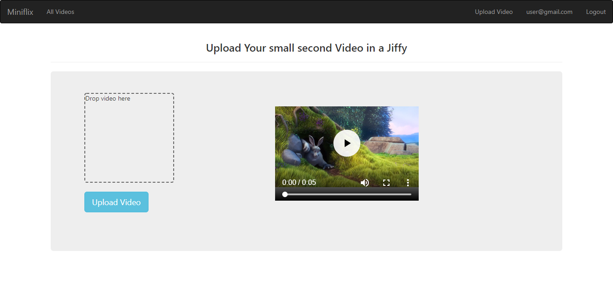
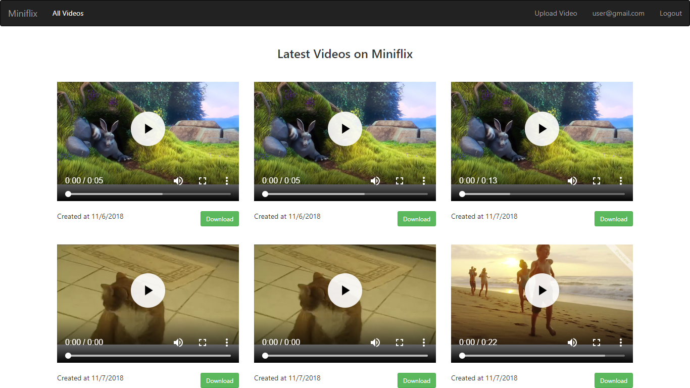

# Reactjs Miniflix

![reactjs-miniflix]



# Features
1. Login and Sigup using Firebase
2. Upload Video to firebase storage
3. Logout

## Setup

Clone the project, install the dependencies, and run the project.

```
git clone https://github.com/manjurulhoque/reactjs-miniflix.git
cd reactjs-miniflix
yarn # or npm install
yarn start # or npm run start
```

Then open up your browser to http://localhost:3000/, and you will be able to see the project.